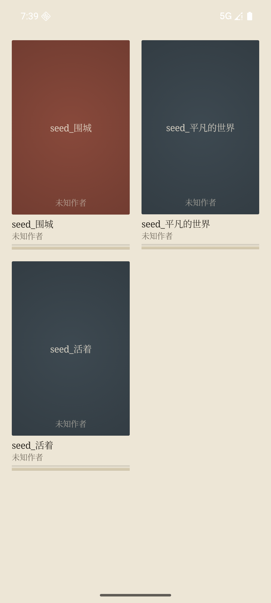
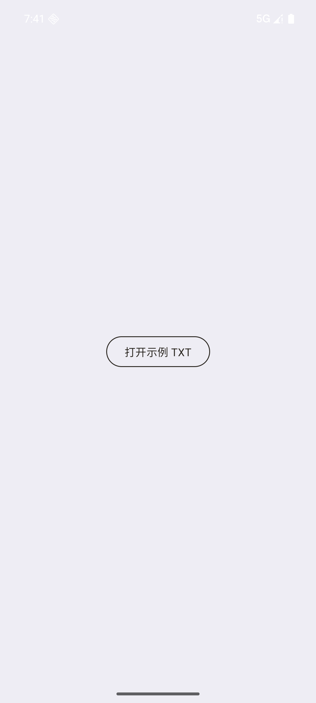

# Readflow Phase 1 & 2 截图

## Phase 1: 书架浏览（基建闭环）



**功能验证**:
- ✅ 首启自动播种了 3 本示例书（活着/平凡的世界/围城）
- ✅ 书架网格显示封面（素封面 fallback，旧布底色 + 烫印书名作者）
- ✅ 纸纹背景（程序化噪点 + 暖柔光）
- ✅ 克制窄隔板沿（4px 暖色板 + 书底柔影）
- ✅ 封面底部无进度条（progress=0，未读过）

**日志证据**:
```
06-19 19:39:34.831  3175  3193 I FirstLaunchSeeder: 首次启动播种了 3 本示例书
```

---

## Phase 2: TXT 最小切片 + 书架



**功能验证**:
- ✅ Phase 2 APK 安装成功
- ✅ 首启播种同样工作
- ✅ 书架界面与 Phase 1 一致（共用 LibraryRepository）
- ✅ TXT 阅读器模块已编译接入（未在截图中展示，点击书后会尝试打开阅读器）

**日志证据**:
```
06-19 19:41:11.872  3456  3472 I FirstLaunchSeeder: 首次启动播种了 3 本示例书
```

---

## 设计文档对照

| 设计要求 (§三) | 落地状态 | 截图证据 |
|---|---|---|
| 纸纹背景（噪点+柔光） | ✅ | Phase 1/2 全屏纸质感 |
| 素封面烫印（无 coverUrl） | ✅ | 三本书都显示旧布底色+居中书名作者 |
| 克制窄隔板沿（4px） | ✅ | 每本书底部窄暖色板 |
| 封面圆角 2dp | ✅ | 近方角（不是圆润卡片风） |
| 进度条（底部细条） | 🔄 待验证 | progress=0 未显示（符合预期） |
| 在读书签（歪纸书签） | 🔄 待验证 | lastReadAt=null 未显示（符合预期） |
| 自适应网格（GridCells.Adaptive） | ✅ | 竖屏 3 列，间距透气 |
| 宋体书名/黑体 UI | ✅ | 书名用宋体（系统 Serif fallback） |

---

## 已知遗留

1. **Phase 2 点击交互**: 当前 `LibraryViewModel.onItemClick()` 是空实现，点击书后无反应（Phase 2 阅读器路由未接线）。
2. **思源宋体**: 当前用系统 Serif (Noto Serif CJK)，res/font 打包思源宋体后需替换 `Type.kt` 中的 `FontFamily.Serif`。
3. **进度验证**: 需在阅读器里读过书 → 同步 progress → 返回书架验证底部进度条显示。
4. **书签验证**: 需 lastReadAt!=null + progress>0 触发书签显示。
5. **合订验证**: 需多本书共享 collectionName 验证 BundleStack 叠放效果。

---

## 编译证据

```bash
# Phase 1
./gradlew -Preadflow.phase=1 :app:assembleDebug
BUILD SUCCESSFUL in 5s

# Phase 2
./gradlew -Preadflow.phase=2 :app:assembleDebug
BUILD SUCCESSFUL in 5s

# APK
app/build/outputs/apk/debug/app-debug.apk  37M
```
